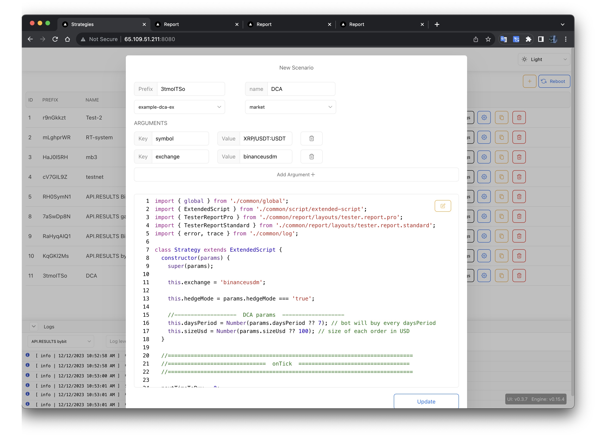
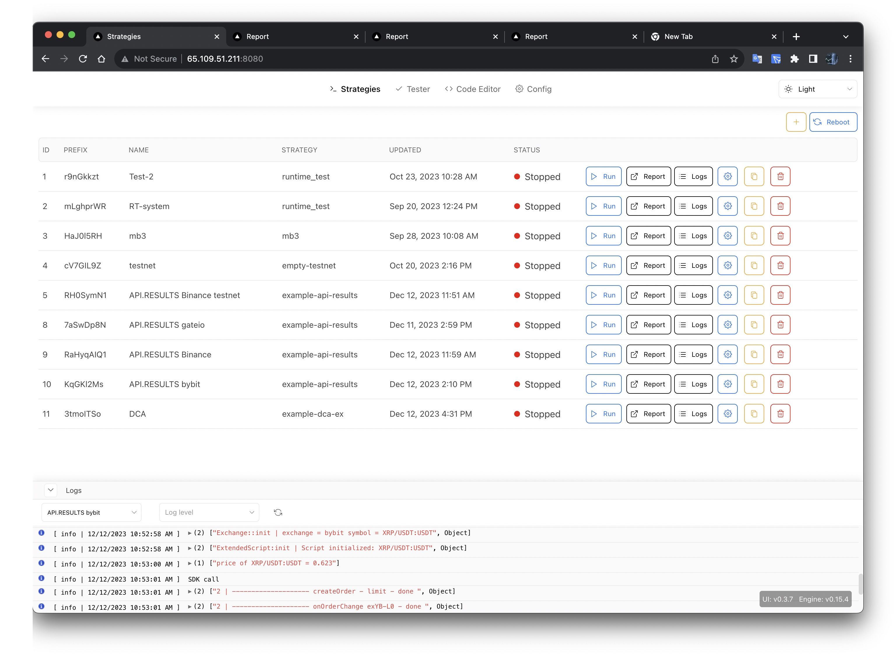

# [Запуск скриптов](#runtime)

## [Создание сценария](#runtime-create-scenario)
### Обязательные Параметры

- `Name`: Название сценария тестирования.
- `Prefix`: Префикс используется для генерации clientOrderId. Скрипты с типом запуска market будут получать только ордера созданная сданным префиксом.
- `Strategy`: Файл торгового скрипта. Внутри файла описан класс Strategy.
- `type` - market или system. 
  - Если тип запуска market, то скрипт будет запущен только для одного symbol. 
  - Если system, то скрипт будет без торговых функций, но сможет получать  уведомления о всех ордерах onOrderChange.
### Стандартные дополнительные пераметры
- `Symbol`: Торговый символ, на котором будет тестироваться стратегия. 
- `Exchange`: Биржа, на которой будет тестироваться стратегия. 
- `isHedge`: Определяет включён ли на бирже режим открытия позиции в обе стороны.

## [Запуск сценария](#runtime-run-scenario)

### Кнопки управления

- `Run`: Запускает сценарий.
- `Stop`: Останавливает сценарий.
- `Report`: Открывает окно отчета.
- `Config`: Обновляет конфигурацию сценария. Без остановки скрипта можно изменить дополнительные параметры. Изменения будут отправлены в скрипт в событие onArgsChange
- `Logs`: Открывает окно логов.
- `Delete`: Удаляет сценарий.

